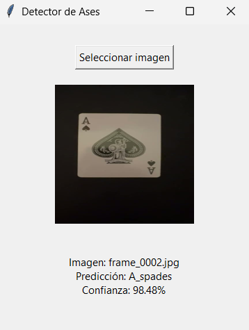

## Card Recognizer

**Card Recognizer** is a computer vision and deep learning project that identifies playing cards. Currently, it focuses on recognizing the four Aces (Hearts, Clubs, Diamonds, and Spades).

### Key Features
- **Card Classification**: Robustly identifies which of the four Aces appears in the image.  
- **OpenCV + Deep Learning**: Utilizes image processing techniques and a neural network (TensorFlow) for classification.  
- **Extensible**: Can be expanded to recognize more cards or different decks.

### Requirements
- **Python 3.7+**  
- **OpenCV**  
- **TensorFlow**  
- **Numpy** (and other dependencies as needed)

### Installation & Preparation
1. **Clone the repository** and move into the folder:
   ```bash
   git clone https://github.com/satorres8/CARD-RECOGNIZER.git
   cd CardRecognizer
   ```
2. **Create a virtual environment** (optional) and **install dependencies**:
   ```bash
   python -m venv venv
   venv\Scripts\activate        # On Windows
   pip install -r requirements.txt
   ```
3. **Gather images** of the four Aces and organize them in `data/train` and `data/test`.

### Training
- Run:
  ```bash
  python trainer.py
  ```
  This script trains the network on your training data and validates it on your test data. It saves the trained model at the end.

### Usage
- **Desktop Application**: After training, **`predict_card.py`** launches a simple GUI to differentiate the four Aces.
  ```bash
  python predict_card.py
  ```
  A file dialog will open so you can select an image, and the app will display which Ace was detected.

### Future Improvements
- Recognize all 52 (or 54) playing cards.  
- Detect multiple cards simultaneously.  
- Optimize the model for mobile devices.

---

### Images 
 
 